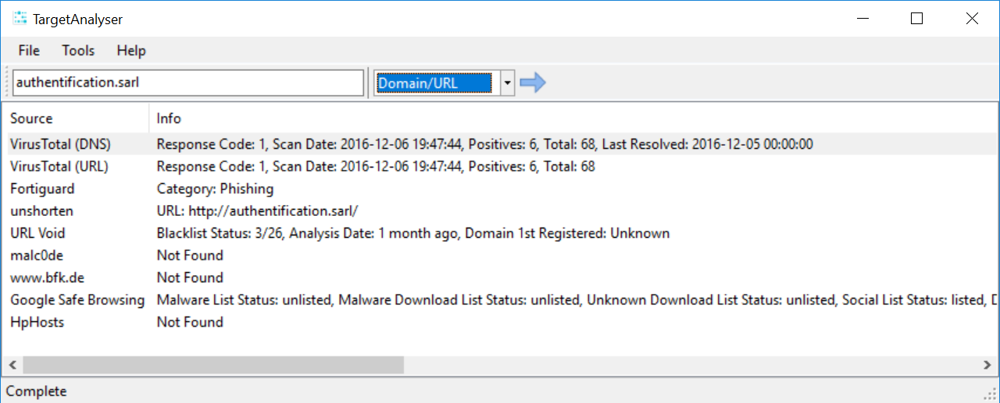
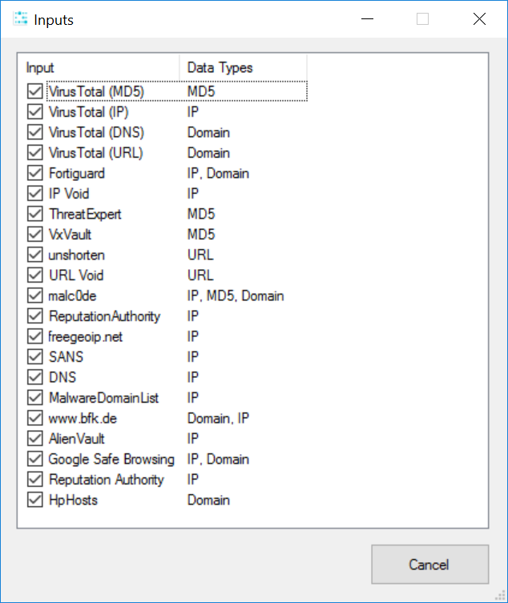

TargetAnalyser
==============

## Info ##

TargetAnalyser is basically a rip off of [Automater](http://www.tekdefense.com/automater/), which is a python script designed to perform URL/Domain, IP Address, and MD5 Hash OSINT tool aimed at making the analysis process easier for intrusion Analysts. 

The issue for me is that sometimes I want to look at the page that produced the output, so a UI provides an easy way to get all the info and yet still provide a quick method to open the page. I have also added a lot more OSINT.

All of the input sources are controlled via the **Inputs.xml** file which is located in the application directory. An example of the configured inputs is shown in the **Inputs** screenshot below.

The inputs use regular expressions to extract information from a HTTP response. There are various options that can be set for the input source; these options are detailed in the **configuration** document.

## Features ##

- Easy to add new sources
- Supports IP, Domain, URL and MD5 lookups
- File input data supported
- Trivially open the web page for the data
- Can show the HTTP response to fix regular expression issues
- Has 20 defined input sources (as of v1.0.0 release)

## Third party libraries ##

- [CommandLine](https://github.com/gsscoder/commandline): Used for command line parsing
- [CsvHelper](https://github.com/JoshClose/CsvHelper): CSV export
- [DNS](http://www.codeproject.com/Articles/23673/DNS-NET-Resolver-C): DNS lookups
- [ObjectListView](http://objectlistview.sourceforge.net/cs/index.html) : Data viewing via lists 
- [VirusTotal.NET](https://github.com/woanware/VirusTotal.NET): Fork from https://github.com/Genbox/VirusTotal.NET
- [Utility](http://www.woanware.co.uk): Misc functions (woanware)

## Third Party

- [Icons8](https://icons8.com): Icons 

## Requirements ##

- Microsoft .NET Framework v4.6.1
- Windows x64

## Screenshots

